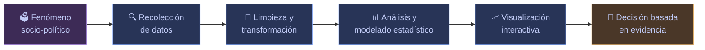
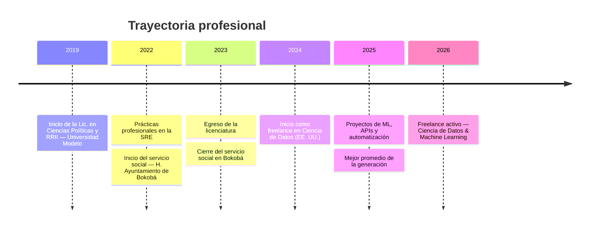
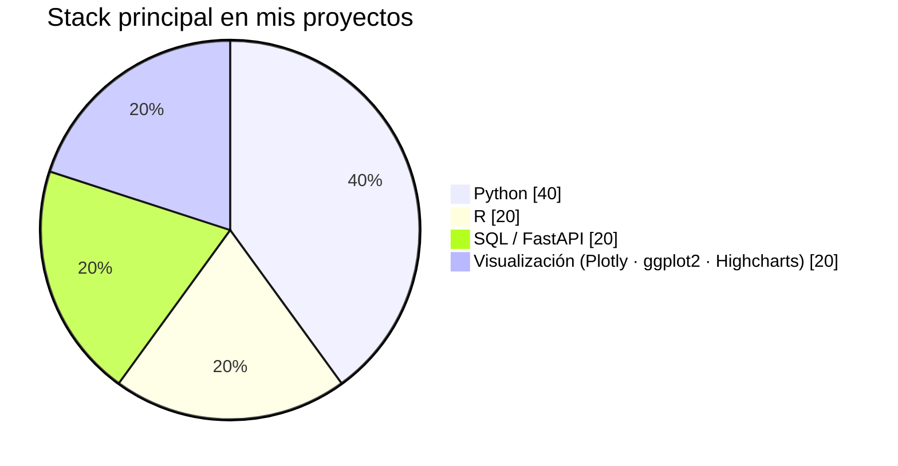

<h1 align="center">¡Hola! Soy Eduardo Barea 👋</h1>

  

  
  
  

  
  

 

## 🧭 Sobre mí

- 🏛️ Politólogo egresado de la **Universidad Modelo** (Mérida, Yuc.), especializado en Ciencias Políticas y Relaciones Internacionales.
- 🏆 Reconocido con el **mejor promedio de mi generación** en la licenciatura (2025).
- 🇲🇽 Experiencia en el sector público: prácticas profesionales en la **Secretaría de Relaciones Exteriores (SRE)** y servicio social en el **H. Ayuntamiento de Bokobá**, donde automaticé procesos de información y medí el impacto de programas municipales en la reducción de la desigualdad.
- 💻 Actualmente trabajo como **freelance en ciencia de datos** para clientes en Estados Unidos: extracción y limpieza de datos, automatización de flujos de trabajo, modelos de Machine Learning, EDA e integración de APIs.
- 🔬 Combino el análisis del entorno sociopolítico con la minería de datos para transformar información compleja en **instrumentos estratégicos de decisión**.
- 🌎 Español nativo · Inglés fluido.
- 📫 Contáctame en **eduardobareapoot@outlook.com**

 

## 🧩 Mi enfoque

Así es como suelo pensar un problema, desde la pregunta sociopolítica hasta la decisión basada en evidencia:

## 🗓️ Trayectoria

 

## 🛠️ Habilidades técnicas

### Lenguajes de programación

  
  
  
  

### Ciencia de datos, análisis y ML

  
  
  
  
  

### Visualización de datos

  
  
  
  
  

### Backend & APIs

  
  
  

### Herramientas y ofimática

  
  
  

### Sistemas operativos

  
  
  
  

 

  

 

## 🚀 Proyectos destacados

| Proyecto | Descripción | Stack |
|---|---|---|
| 🗳️ **Base de datos electoral** | Base de datos relacional y normalizada sobre los procesos electorales en México. | `FastAPI` `SQL (SQLite)` `Python` |
| 🤖 **Chatbot INEGI** | Chatbot que consume la API del INEGI para ofrecer información oficial y actualizada a partir de preguntas del usuario. | `Python` `Flask` `API DeepSeek` |
| ⚖️ **Regresión logística — Defunciones INEGI** | Transformación de datos crudos de las Estadísticas de Defunciones Registradas 2023 y modelo con precisión superior al 70% para predecir factores asociados a homicidios de mujeres. | `Python` `R` `Regresión logística` |
| 📡 **Consumo API del INEGI** | Scripts para la consulta y descarga de información oficial del Banco de Indicadores y el Banco de Información Económica. | `Python` `APIs REST` |

 

## 📌 Repositorios fijados

  
  
  
  

 

## 📊 Estadísticas de GitHub

  
  

  

  

<h3>🏆 Trofeos de GitHub</h3>

  

 

## 🎓 Reconocimientos

- 🥇 **Mejor promedio de la generación**, Lic. en Ciencias Políticas y Relaciones Internacionales — Universidad Modelo, Mérida, Yuc. (2025)

 

---

  

<i>Gracias por visitar mi perfil — siempre abierto a colaborar en proyectos donde los datos y las políticas públicas se encuentren. 🤝</i>

